# dtree

> A directory-based persistence layer for building, recording, and auditing decisions.

[](#status)

`dtree` lets engineering teams record decisions as plain YAML files in a directory tree, track typed relationships between them (`blocks`, `influences`, `supersedes`, `relates_to`), maintain an append-only audit log, and surface the result through a CLI, a local web UI, and an MCP server for AI agents.

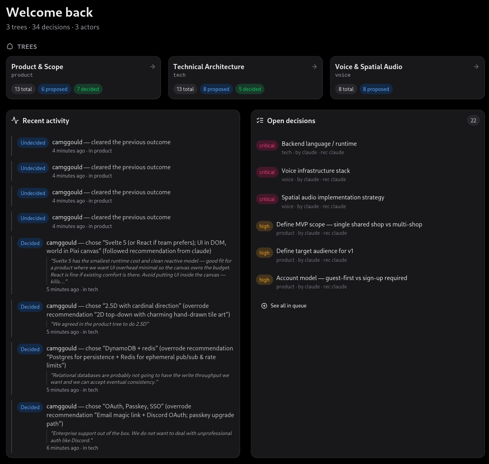

## Status

**Beta — feature-complete for v1.** The data model and storage formats are stable. Server and CLI surface are stable. UI is functional and being polished.

## What is dtree?

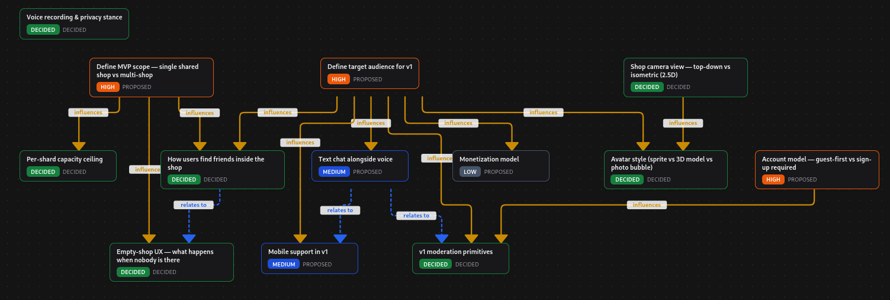

Most teams scatter decision-making across Slack threads, ad-hoc docs, and engineers' heads. Six months later, no one remembers why a decision was made — or even that it was made.

`dtree` makes decisions a first-class artifact:

- **Directory-based.** Each decision tree is a subdirectory under `.decisions/`. Each decision is a YAML file. Plain text, version-controlled by your existing git workflow.
- **Auditable.** Every mutation (create, update, decide, scope-out, supersede, relate) is recorded in an append-only JSONL audit log, monthly-partitioned. Replay state at any point in time.
- **Relational.** Decisions form a typed graph. The web UI lays the graph out with [ELK](https://www.eclipse.org/elk/) (collision-aware orthogonal routing) so you can see at a glance what blocks what.
- **Multi-identity.** Track who created, who decided, who recommended. Distinguish humans from AI agents. Measure how often agent recommendations get accepted vs overridden.
- **CLI, web UI, and MCP.** Use `dtree` from the terminal, browse decisions in a polished local web UI (`dtree ui`), or expose tools to AI agents (`dtree mcp`).

## Installation

### From source (current path)

Until the first release is tagged, build from source. Requires Go 1.25+ and Node 20+:

```sh
git clone https://github.com/camggould/dtree.git
cd dtree
make setup    # installs Go + npm deps and regenerates TS types
make ui       # builds the embedded web UI
make build    # produces ./dtree (single binary, UI baked in)
sudo install -m 0755 dtree /usr/local/bin/dtree
```

The resulting binary is fully self-contained — UI baked in, SQLite (with FTS5) statically linked, no runtime deps beyond libc.

### Pre-built binaries 

Install with this command:
```sh
curl -fsSL https://raw.githubusercontent.com/camggould/dtree/main/install.sh | sh
```

It detects your OS/arch (linux, darwin × amd64, arm64), downloads the matching tarball, verifies its SHA-256, and installs to `/usr/local/bin/dtree` (falling back to `~/.local/bin` if needed). Pin a version with `... | sh -s -- --version vX.Y.Z`; see `install.sh --help` for all flags.

### Verify

```sh
dtree version
```

## Quickstart

```sh
# 1. One-time machine setup
dtree config set --global identity.default cam

# 2. In your project repo (init is interactive by default; --non-interactive
#    + flags is the script-friendly form)
dtree init                                   # creates .decisions/ + registers your identity
# dtree init --non-interactive --actor-handle cam --actor-name "Cam" \
#   --actor-email cam@example.com --first-tree backend
dtree tree create backend --title "Backend Architecture"
dtree actor add alice --name "Alice" --email alice@example.com

# 3. Create a decision (opens $EDITOR with a YAML template)
dtree new "Pick database engine" --tree backend --priority high

# 4. Find proposed decisions
dtree ls --status proposed

# 5. Decide it (id-prefix is fine; 4+ chars unambiguous)
dtree decide 01HX --by cam --choice "SQLite + FTS5" \
  --reason "Single-binary requirement; FTS5 ships built-in."

# 6. Browse in the web UI
dtree ui                                     # opens browser to the local server

# 7. Expose decision tools to your AI assistant
dtree mcp --as cam                           # stdio transport for MCP clients
```

## Concepts

### Decision tree

A named collection of decisions. Stored as a subdirectory under `.decisions/<slug>/`. Most projects have one or two trees; teams with multiple workstreams may have more.

### Decision

A YAML file capturing a single decision. Required: `summary`, `priority`, `status`. Optional: recommendation, outcome, relationships, tags, free-form description (in `decision_full_description`).

```yaml
id: 01HXKQ5Z3PCWJ8FQR4M2TVB7D9
slug: pick-database-engine
schema_version: 1
summary: Pick database engine
priority: high
status: decided
creator: cam
recommended_summary: SQLite + FTS5
recommended_full: |
  Single-binary requirement is non-negotiable. SQLite ships FTS5
  out-of-the-box and Litestream covers the backup story.
recommended_by: cam-claude
actual_choice: SQLite + FTS5
actual_choice_reason: Approved as recommended.
decided_by: [cam, alice]
is_recommended: true
decision_full_description: |
  Long-form context, options, constraints, etc.
relationships:
  - type: blocks
    target: 01HXKQ7N9MR4VXBPDTYFW2K8H1
```

### Status

|   | Meaning |
|---|---|
| `proposed` | Default after creation; not yet decided |
| `decided` | An `actual_choice` has been recorded |
| `out_of_scope` | Explicitly declined; not going to be decided |
| `superseded` | Replaced by another decision |

### Priority

`assumption` · `low` · `medium` · `high` · `critical`

`assumption` is special — a low-ceremony "we're going to take this as given" that lands as `decided` on creation via `dtree assume`. It's recorded but excluded from action queues and rendered with its own visual treatment in the UI.

### Relationship types

|   | Meaning |
|---|---|
| `blocks` | Target cannot be acted on until source is in a terminal state |
| `influences` | Source informs target's outcome (no hard constraint) |
| `supersedes` | Source replaces target (drives target → `superseded`) |
| `relates_to` | Weak relatedness, no constraint, decoration only |

### Identity

Every action is attributed to a *handle* — a stable, registered identity. Handles can be `human` or `agent` (LLM). Identities are configured globally (`~/.config/dtree/config.yaml`) and registered per-project (`.decisions/actors.yaml`).

## Usage guide

### Initialize a project

```sh
dtree init                          # creates .decisions/ and prompts to register your identity
dtree tree create <slug> --title "Display name"
```

### Create decisions

```sh
dtree new "Summary"                                       # opens $EDITOR with a template
dtree new "Summary" --priority high --tag storage         # inline flags
dtree new "Summary" --from-file draft.yaml                # full YAML body
echo '...' | dtree new "Summary" --from-stdin             # via stdin
dtree assume "Users have stable IDs" \
  --choice "ULID" --reason "Compact; lexicographically sortable."
```

### View decisions

```sh
dtree ls                                  # default: proposed + decided
dtree ls --status proposed --priority high,critical
dtree ls --tag storage --since 30d
dtree show <id>                           # full decision (id-prefix or summary substring)
dtree find "database"                     # FTS5 search
```

### Lifecycle actions

```sh
dtree decide <id> --choice "..." --reason "..." --by cam
dtree decide <id> --by cam --by alice --is-recommended    # accept the recommendation
dtree undecide <id>                                       # back to proposed
dtree scope-out <id> --reason "Not relevant after pivot"
dtree restore <id>                                        # reverse scope-out
dtree supersede <old-id> --by <new-id>
```

### Relationships

```sh
dtree relate <src> blocks <target>
dtree relate <src> influences <target>
dtree unrelate <src> blocks <target>
```

### Graph queries

```sh
dtree graph deps <id>                     # what blocks this decision?
dtree graph downstream <id>               # what does this decision block?
dtree graph closure <id>                  # transitive closure
dtree graph cycles                        # any blocks-cycles in the tree?
dtree graph viz <id> | dot -Tsvg -o tree.svg
```

### Queues (guided workflow)

```sh
dtree queue spearhead                     # decisions blocking the most others
dtree queue spearhead --tree backend --limit 5
dtree queue quick-wins                    # unblocked, ready to close
```

The web UI presents the same queues as a one-decision-at-a-time walker.

### Audit

```sh
dtree audit ls                            # all events (paginated)
dtree audit ls --actor cam --since 7d
dtree audit ls --decision <id>            # one decision's history
dtree audit show <event-id>
dtree audit replay --tree backend --at 2026-04-22T14:32:11Z
```

### Identity & config

```sh
dtree whoami                              # show resolved identity
dtree config set --global identity.default cam
dtree config set --local default_tree backend
dtree config get identity.default         # show value + scope
dtree config list                         # all resolved keys
dtree as cam-claude new "..."             # one-shot identity override
```

### Servers

```sh
dtree serve                               # HTTP API on 127.0.0.1:8080
dtree serve --addr 0.0.0.0:8080 --trust token   # network bind (require Bearer tokens)
dtree token create --as cam --label "laptop"    # mint a token for network access
dtree ui                                  # serve + open browser to the embedded UI
dtree mcp --as cam-claude                 # MCP stdio for agents
dtree mcp --as cam-claude --read-only     # safe-mode: query-only tools
```

### Repo maintenance

```sh
dtree status                              # health + summary stats
dtree reindex                             # rebuild SQLite index from YAML
dtree sync                                # reconcile external file edits
dtree fsck                                # validate invariants
dtree migrate                             # run schema migrations
```

## Configuration

### Layered config (git-style)

| Layer | Path |
|---|---|
| Global | `~/.config/dtree/config.yaml` |
| Local | `.decisions/config.yaml` |
| Env | `DTREE_AS`, `DTREE_TREE` |
| Flags | `--as`, `--tree` |

Higher layers override lower. `dtree config get <key>` shows the resolved value and which scope it came from.

### Common keys

```yaml
identity:
  default: cam
editor: $EDITOR        # falls back to vi
output: human          # human | json | yaml
color: auto            # auto | always | never
default_tree: backend  # used when --tree is omitted (single-tree repos)
```

## Web UI

```sh
dtree ui
```

Features:
- **Graph view** — interactive tree laid out by ELK with orthogonal edge routing (no edges through nodes). Status-colored, priority-colored when proposed, click a node to open its detail modal.
- **Decision modal** — overview / history / audit-flow tabs; one-click "Accept recommendation"; click related decisions to navigate within the modal.
- **Kanban** — read-only swimlanes by status (out-of-scope · proposed · superseded · decided).
- **Queues** — one-decision-at-a-time walker for Quick Wins / Spearhead, with prev/next/skip and inline actions.
- **Audit log** — searchable event table, live-tail via SSE, click any decision row to open its modal.
- **Dashboard** — multi-tree filter, per-actor drill-down (Created / Recommended / Decided facets), agent-vs-human delegation breakdown, recommendation-acceptance headline metric, all click-through to the underlying decisions.
- **Identity selector** — first-run flow + dropdown to switch acting identity for mutations.
- **Sync with chat** — Decisions made in the UI are discoverable by your agentic companions, and vice versa.

The UI is served from `localhost` only by default. The same server runs headless via `dtree serve`.

### All your repo's decision activity at a glance


### Three ways of viewing and interacting with your decisions

#### Graph view


#### Kanban view

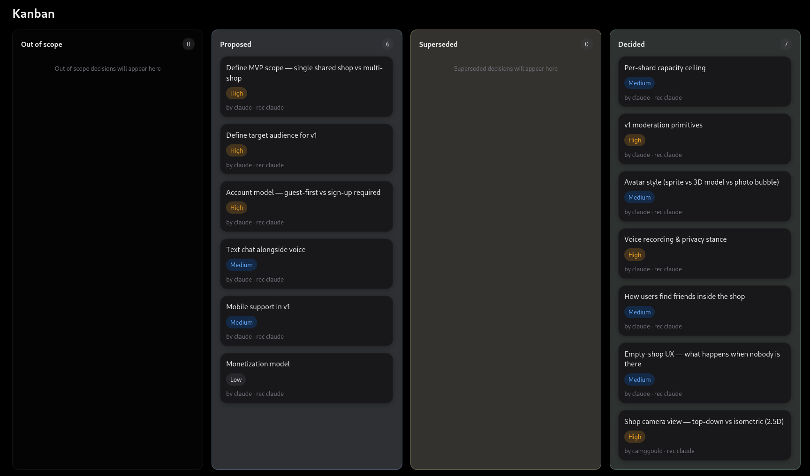

#### Queue view

Explore quick wins to resolve anything that is unblocked first, or go spearhead mode to focus on the most critical blockers first.

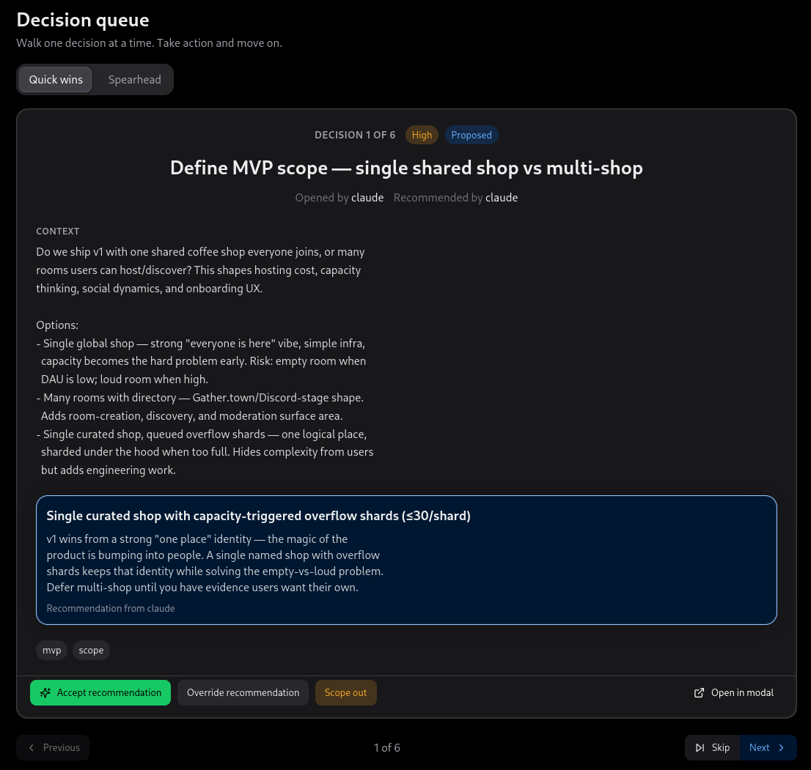

### See the history of your decision

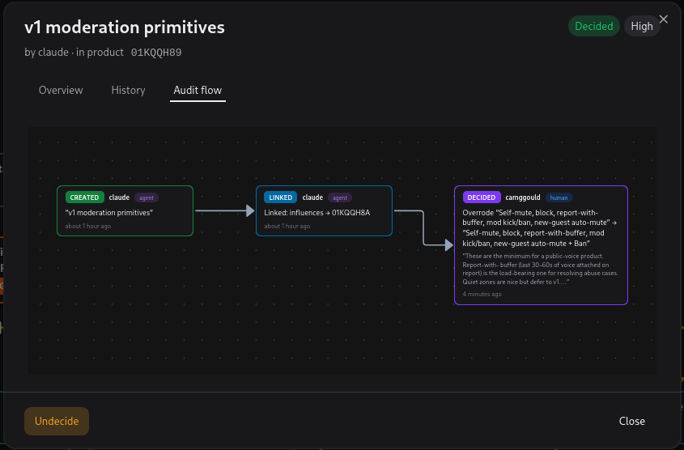

### Bring your team; humans and agents
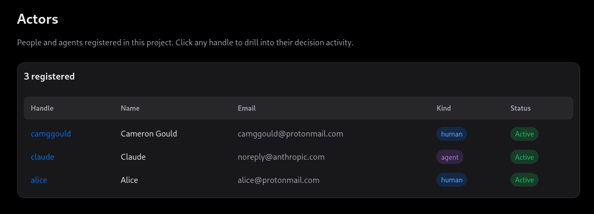

### Extract insights across your decisions

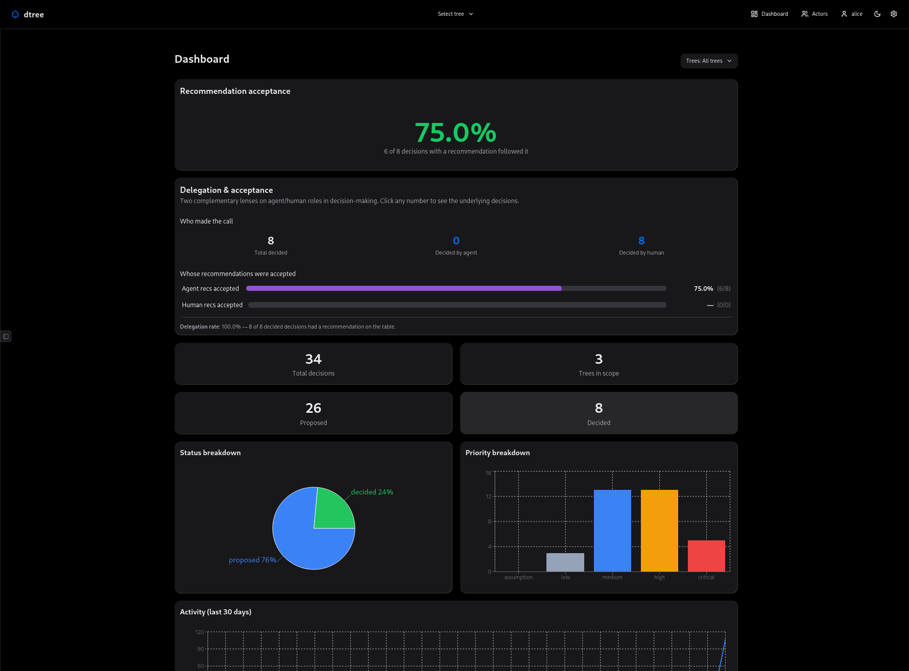

### Understand the quality of your agent's recommendations

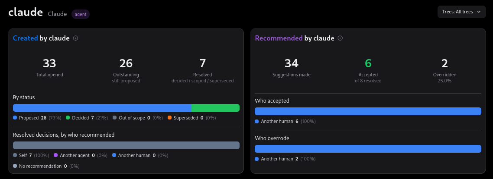

### See who trusts their agentic companions the most

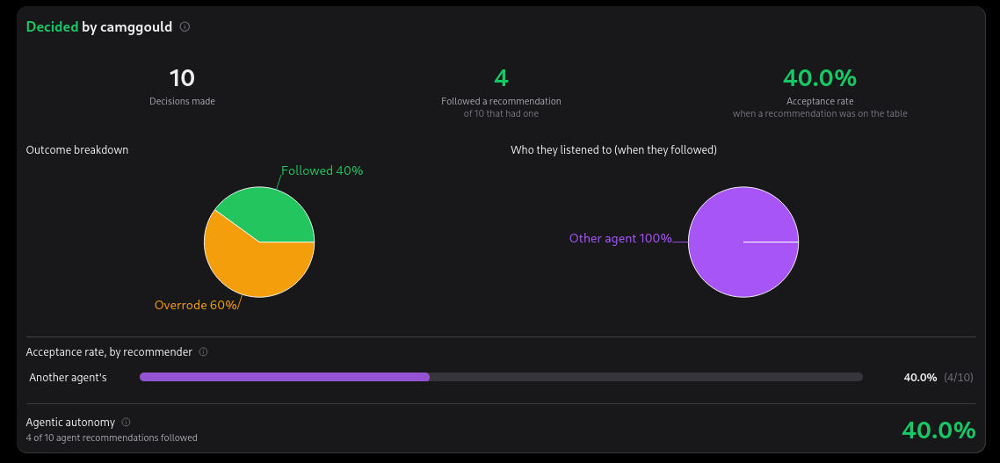

### Track decisions in real time

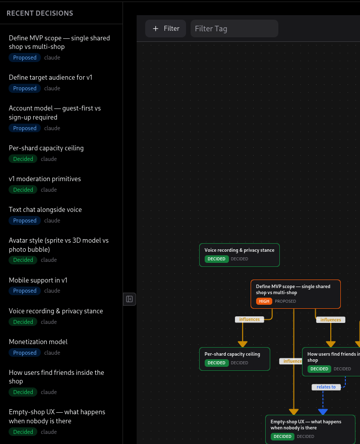

### Audit decision history

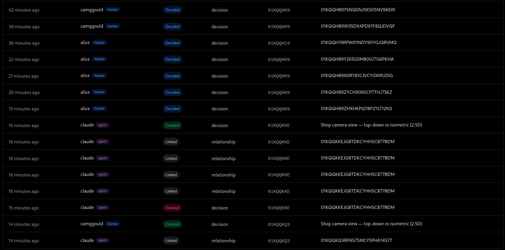

### Accept recommendations, or go your own way

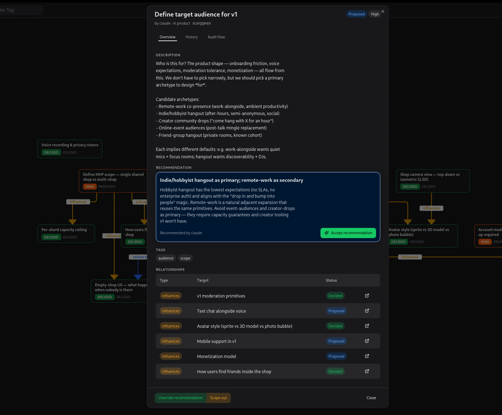


## MCP integration (AI agents)

`dtree mcp` exposes tools and resources via the Model Context Protocol. Add to your MCP client's config:

```json
{
  "mcpServers": {
    "dtree": {
      "command": "dtree",
      "args": ["mcp", "--as", "cam-claude"]
    }
  }
}
```

**Tools** (mirror the HTTP surface): `get_tree`, `create_tree`, `update_tree`, `archive_tree`, `list_decisions`, `get_decision`, `create_decision`, `update_decision`, `delete_decision`, `decide_decision`, `undecide_decision`, `scope_out_decision`, `supersede_decision`, `restore_decision`, `relate_decisions`, `unrelate_decisions`, `decision_history`, `find_decisions`.

**Resources**: `dtree://trees`, `dtree://trees/{tree}`, `dtree://trees/{tree}/decisions/{id}`, `dtree://actors`.

All mutations are attributed to the handle the server was launched as and recorded in the audit log with the actor's `kind` (`human` or `agent`).

Use `--read-only` to give agents query-only access. See `SKILL.md` for an agent-facing usage guide.

## Developer guide

### Prerequisites

- Go 1.25+
- Node 20+ and npm 10+ (for the UI)
- `make`

### Setup

```sh
git clone https://github.com/camggould/dtree.git
cd dtree
make setup      # installs Go + npm deps, regenerates TS types
```

### Common targets

```sh
make ui          # build the SPA into internal/uifs/dist/
make build       # build ./dtree (single binary with embedded UI)
make ui-dev      # vite dev server with HMR (proxies /v1 to :8080)
make test        # go test ./...
make lint        # go vet ./...
make coverage    # tests + coverage summary
make api         # alias for make ui-types — regenerate TS types from Go
make dev         # build UI + binary, then run dtree serve
```

For a tight loop while iterating on the UI: run `make ui-dev` in one terminal and `dtree serve` (with `--repo-root <somewhere>`) in another. The Vite proxy forwards `/v1/*` to the running server.

### Project structure

```
cmd/dtree/                  # CLI entrypoint (calls into internal/cli)
internal/
  audit/                    # append-only event log + hooks
  cli/                      # cobra command tree (dtree new, decide, …)
  concurrency/              # rev tokens, conflict types
  config/                   # layered config resolution
  core/                     # domain types + validation
  fsutil/                   # atomic writes, file locks
  identity/                 # actor resolver + actors.yaml
  index/                    # SQLite schema, queries, migrations
  mcp/                      # MCP server (tools + resources + notifications)
  migrations/               # schema-version migration registry
  server/                   # HTTP API (chi router + RFC 7807 errors)
  storage/                  # YAML decision read/write
  sync/                     # external-edit reconciliation
  ulid/                     # ID generation
  uifs/                     # //go:embed for the built SPA
  validate/                 # struct validators
ui/                         # frontend (Vite + React 19 + TS strict + HeroUI v2)
tygo.yaml                   # Go → TypeScript type generation config
```

### Type sharing

Go is the source of truth. After modifying types in `internal/core`:

```sh
make api                    # regenerates ui/src/api/types.gen.ts
git add ui/src/api/types.gen.ts
```

### Storage format

- **Decisions**: YAML with structured fields and block-scalar prose.
- **Audit log**: append-only JSONL, monthly-partitioned (`audit/YYYY-MM.jsonl`), `merge=union` for distributed contributors.
- **Tree metadata**: YAML at `.decisions/<slug>/tree.yaml`.
- **Actors**: YAML at `.decisions/actors.yaml`.
- **Index**: SQLite (WAL mode, gitignored, fully rebuildable from YAML + audit).

### Build tag

Everything is built with `-tags sqlite_fts5` so the bundled SQLite includes FTS5. The Makefile sets this; if invoking `go` directly, pass it.

### Contributing

Issues are tracked via [beads](https://github.com/gastownhall/beads):

```sh
bd ready                   # find unblocked work
bd show <id>               # task detail
bd close <id> --reason "Implemented in PR #X"
```

Pull requests should:

1. Address a single bd issue (or include a `bd close` line in the description).
2. Include tests (Go for backend, Vitest for UI changes).
3. Update generated artifacts (`make api` if the API surface changed).
4. Pass `make lint && make test`.

## License

MIT
